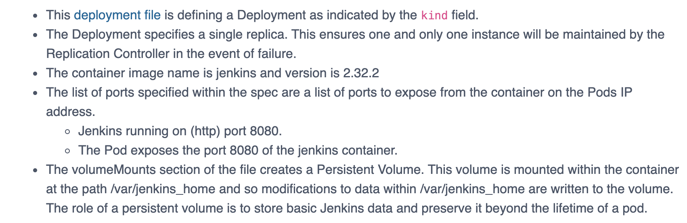
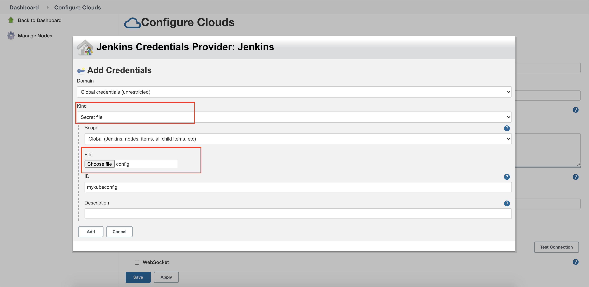

# IBM_Kubernetes_with_Jenkins
Build a DevOps pipeline for continuous integration pipelines on an IBM Cloud Kubernetes Service cluster

Jenkins:
Jenkins is an open source automation server which can be used to automate all sorts of tasks related to building, testing, and delivering or deploying software.

Kubernetes: 
Kubernetes is a portable, extensible, open-source platform for managing containerized workloads and services, that facilitates both declarative configuration and automation

In this tutorial, we will learn about CI&CD using Jenkins on IBM Kubernetes service. 


## Prerequisites
You need the following tools to complete the steps in this tutorial:
* [IBM Cloud](https://cloud.ibm.com/registration) account.
* Access to the [IBM Cloud Kubernetes Service](https://cloud.ibm.com/kubernetes/catalog/create) to create a Kubernetes cluster. If needed, you can create [one free cluster](https://cloud.ibm.com/docs/containers?topic=containers-cs_ov#cluster_types) for 30 days to get familiar with Kubernetes capabilities.
* A [GitHub](https://github.com/) account and some knowledge of [Git commands](https://training.github.com/).


## Steps

1. [Access IBM Kubernetes service](#step-1-Access-IBM-Kubernetes-service)
1. [Access IBM Kubernetes service](#step-2-Access-IBM-kubernetes-service)
1. [Install Jenkins with YAML files](#step-3-create-a-persistent-volume)
1. [Access Jenkins dashboard & login](#-Step-4-Access-Jenkins-dashboard-&-login)


 

### Step 1. Access IBM Kubernetes service
```
ibmcloud login -a https://cloud.ibm.com -u passcode -p pass 
ibmcloud ks cluster config --cluster mycluster
kubectl config current-context
```

### Step 2. Create a namespace 
A distinct namespace provides an additional layer of isolation and more control over the continuous integration environment.

```
$ kubectl create namespace jenkins
$ kubectl get namespaces

```

### Step 3. Install Jenkins with YAML files
This section describes how to use a set of YAML (Yet Another Markup Language) files to install Jenkins on a Kubernetes cluster.

* Deployment file available [here](updatee)

__Note__ : Description of deployment file 



* Run command to execute the deployment:
```
$ kubectl create -f jenkins-deployment.yaml -n jenkins

```
* To validate

```
$ kubectl get deployments -n jenkins

```

* Expose the deployment:
We have a Jenkins instance deployed but it is still not accessible,to make it accessible outside the cluster the Pod needs to be exposed as a service.

Service File available [here](update)
```
$ kubectl create -f jenkins-service.yaml -n jenkins

```

* To validate

```
$ kubectl get services -n jenkins
```

### Step 4. Access Jenkins dashboard & login

* Get worker node details, and under address note __ExternalIP__ 
```
kubectl get nodes
kubectl describe node 10.144.180.39
```

* Also note port where the jenkins service is running, note __PORT__ from details

```
kubectl get svc -n jenkins
```

* Now to open jenkin dashboard, in new web terminal use __ExternalIP:PORT__

* There is __Administrator password__ required, for that run below command and scroll the logs untill there is Please use the following password ...

* Continue the installation, leave the configuration as same. Then you will be in the dashboard. 

```
kubectl logs jenkins-585799558b-jks42  -n jenkins
```


### Step 5. Create a service account
In Kubernetes, service accounts are used to provide an identity for pods.

1. File available here jenkins-sa.yaml.
1. Run the command 
```
kubectl apply -f jenkins-sa.yaml
```

### Configure IBM Container Registry & Kubernetes API keys

We need to configure this because we will push our container images to it. 
[Note: We will run all the commands from CLI]

* Create registry

```
ibmcloud cr login
ibmcloud cr namespace-add jenkins-registry-\<UNIQUE_NAME_ACROSS_IBM>
```

* Now we need API key to access it from Jenkins Pipeline.
 __WARNING:__ You will not be able to see this key again, so be sure to copy and save it. Ever 1 hour later this token expires

```
ibmcloud iam api-key-create ibm-cloud-api-key-for-jenkins
```

* You need two Kubernetes secrets:
1. To create the secret for pushing images and Kubernetes deployments, use the following commands:

```
kubectl create secret generic ibm-cloud-api-key --from-literal apikey=<replace_your_ibm_cloud_api_key_for> --namespace jenkins
```
__Note:__ You will use this secret when configuring the private registry access in the Jenkins job.

2.To configure service account with the secret for pulling images, use the following commands:

```
kubectl patch serviceaccount default -p '{"imagePullSecrets": [{"name": "all-icr-io"}]}' -n default
```

### Step 7. Configure Kubernetes Plugin

* First Go to Manage Jenkins from the menu and then Manage Plugins. From the Available tab, find the Kubernetes plugin and install it.

* Nagivate to Manage Jenkins > Manage Nodes & Cloud > Cloud > Add a new cloud, then select “Kubernetes”

* Under kubernetes cloud details > Credentials select __Add__ > Jenkins
  Kind= secret file , upload config file (~./kube/config)
  
  

* In Jenkins URL , get the URL with 

```
kubectl describe service jenkins -n jenkins | grep Endpoint
```

* Select Test connection output must be __Connected to Kubernetes v1.19.9+IKS__


### Step 8. Create pipeline

* Before creating pipeline make the changes in the Jenkinfile
   1. Under __build__ stage replace_your_namespace
   1. Under __deploy__ stage , put you cluster name and namespace 


* From dashboard, on left select __New Item__
* Enter name __Demo__ and select __Pipeline__ from below options
* On next page from Pipeline Definition select __script from SCM__ , click Git and insert this [giturl](https://github.com/mahsankhaan/kubernetes_with_jenkins.git).
* From left select __Build Now__
*  Description of [Jenkinsfile]()
   1. Cloud: Kubernetes. This is preconfigured for us in the Jenkins installation. We will show this configuration after the pipeline.
   1. Label: This is the tracking mechanism in Jenkins. We will target this pod later in the pipeline using this label.
   1. Containers: this is the section we define containers in the pod. It uses ContainerTemplate
   1. volumes: Volume binding configuration in Kubernetes pod spec. Binding docker socket to pod so we can build docker containers in build stage.
   1. node: script tells Jenkins to target a pod. "workshop" is the label that we want Jenkins to create for this pipeline.
